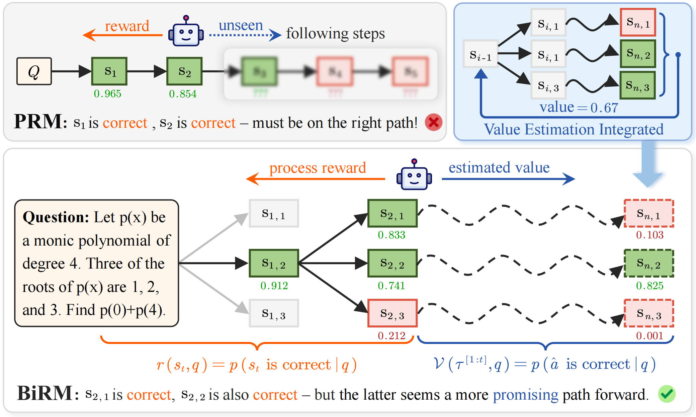
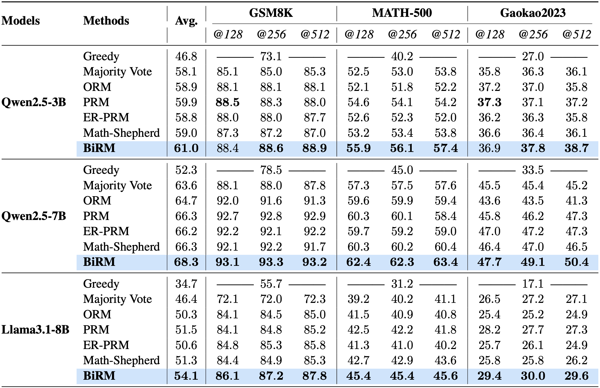
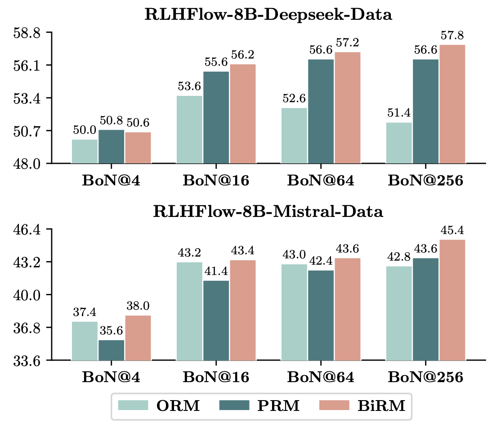

# Better Process Supervision with Bi-directional Rewarding Signals (BiRM)

[](https://arxiv.org/abs/2503.04618) [](https://huggingface.co/datasets/KevinChenwx/BiRM-Qwen2.5-3b-base-data) [](https://huggingface.co/datasets/KevinChenwx/BiRM-Qwen2.5-7b-base-data) [](https://huggingface.co/datasets/KevinChenwx/BiRM-Llama3.1-8b-base-data)


## 🌟 Introduction

In this work, we draw inspiration from the A* algorithm, which states that **_an effective supervisory signal should simultaneously consider the incurred cost and the estimated cost for reaching the target_**. 

We introduce **BiRM**, a novel process supervision model that not only evaluates **the correctness of previous steps** but also models **the probability of future success**. We demonstrate that BiRM provides more precise evaluations of LLM reasoning steps, achieving an improvement of 3.1% on Gaokao2023 over PRM under the Best-of-N sampling. Besides, in search-based strategies, BiRM provides more comprehensive guidance and outperforms ORM by 5.0% and PRM by 3.8% respectively on MATH-500.

<div align=center></div>

> Figure: An example of our proposed **BiRM** compared with traitional process reward models (PRMs). Given a question _q_, PRMs only consider the accumulated rewards up to the current step. In contrast, BiRM takes into account two aspects: the correctness rewards received so far and the probability of reaching correct final answers.

## 📊 Main Results

<div align=center></div>

> Table: Performance of Best-of-N sampling on GSM8K, MATH-500 and Gaokao2023 with three base models. The accuracy of the BoN solution is utilized as the evaluation metric. The results are reported as the average accuracy across five random seeds. 

<div align=center></div>

> Figure: Performance comparison of ORM, PRM and BiRM under BoN sampling. The base models are open-source [RLHFlow-8B-Deepseek-Data](https://huggingface.co/RLHFlow/Llama3.1-8B-PRM-Deepseek-Data) and [RLHFlow-8B-Mistral-Data](https://huggingface.co/RLHFlow/Llama3.1-8B-PRM-Mistral-Data).

## 🛠 Install
```bash
git clone https://github.com/chenwxOggai/BiRM.git
cd BiRM
conda create -n birm python=3.9
conda activate birm
pip install -r requirements.txt 
```

The key python packages used in this work are listed below:
- torch==2.5.1
- transformers==4.46.2
- accelerate==1.1.1
- deepseed==0.14.4
- flash_attn==2.5.2
- vllm==0.6.4.post1


## ⌛️ Training

### 1. Training Generators
We use the MATH part of the [MetaMath dataset](https://huggingface.co/datasets/meta-math/MetaMathQA) for SFT training. We also re-annotate the “reasoning step” using Deepseek-V3 to reduce redundancy and bias. The dataset is available at 🤗[KevinChenwx/BiRM-MetaMath-SFT-data](https://huggingface.co/datasets/KevinChenwx/BiRM-MetaMath-SFT-data).

Before training, configure the SFT dataset `~/BiRM/data/MetaMathQA-MATH/train.jsonl` and the training script `~/BiRM/scripts/train_generator.sh`.

```bash
cd ~/BiRM/scripts/
bash train_generator.sh
```

### 2. Training BiRMs


| Models           | 🤗 Dataset Repo                                                                                                  |
| ---------------- | --------------------------------------------------------------------------------------------------------------   | 
| Qwen2.5-3B-base  | [KevinChenwx/BiRM-Qwen2.5-3b-base-data](https://huggingface.co/datasets/KevinChenwx/BiRM-Qwen2.5-7b-base-data)   |
| Qwen2.5-7B-base  | [KevinChenwx/BiRM-Qwen2.5-7b-base-data](https://huggingface.co/datasets/KevinChenwx/BiRM-Qwen2.5-7b-base-data)   |
| Llama3.1-8B-base | [KevinChenwx/BiRM-Llama3.1-8b-base-data](https://huggingface.co/datasets/KevinChenwx/BiRM-Llama3.1-8b-base-data) |

A sample data entry is listed below. `label` represents the rule-based correctness, while `step_label` is the reward label annotated using Deepseek-V3 . `step_h_label` and `step_s_label` represent the Math-Shepherd hard label and soft label obtained via Monte-Carlo sampling, respectively. These labels are used as value labels.

```json
{
    "idx": 7180,
    "input": "If $a + b + c = 11$ and $ab + ac + bc = 25,$ then find\n\\[a^3 + b^3 + c^3 - 3abc.\\]\n",
    "question": "If $a + b + c = 11$ and $ab + ac + bc = 25,$ then find\n\\[a^3 + b^3 + c^3 - 3abc.\\]\n",
    "answer": "We have the ...The answer is: 506",
    "ground_truth": "506",
    "outputs": [
        {
            "response": "We notice that ... ки\n ... ки\n ... ки\nThe answer is: 506ки",
            "response_answer": "506",
            "label": true,
            "step_labels": [
                false,
                false,
                false,
                false,
                false,
                true
            ],
            "step_h_label": [
                false,
                false,
                false,
                true,
                true,
                true
            ],
            "step_s_label": [
                0.75,
                0.125,
                0.875,
                1.0,
                1.0,
                1.0
            ]
        },
        ...
    ]
}
```


Before training, configure datasets `~/BiRM/data/Qwen2.5_7b_BiRM/train/responses_n15_qwen2.5_7b_math_process.jsonl` and training scripts `~/BiRM/scripts/train_birm.sh`.

```bash
cd ~/BiRM/scripts/
bash train_birm.sh
```


## 📝 Evaluation

### 1. Launch vLLM API Service

We deploy the generator as a vLLM API service to support data sampling and beam search evaluation. The vLLM port numbers are set from `36100` to `36107`, and you can modify them as needed.

```bash
cd ~/BiRM/scripts/
bash vllm_tmux.sh
```

### 2. Best-of-N sampling

```bash
# 1. launch vllm service
cd ~/BiRM/scripts/
bash vllm_tmux.sh

# 2. sample N solutions on test set
bash generate_n_solution.sh

# 3. evaluate reward models
bash eval_with_birm.sh
```

The sampling results will be saved to `~/BiRM/data/${dataset}-512/model_generation/`.
The evaluation results will be saved to `~/BiRM/eval_results/${dataset}-512/verifier/test/`.

```bash
# process BoN results, five random seeds
# 1. pre-process evaluation results
bash small_file.sh

# 2. test different beta for different tasks
python add_birm_verifier.py

# 3. calculate birm_scores
bash shuffle_BoN.sh
```

### 3. Step-level Beam Seach

```bash
# 1. launch vllm service
# set --gpu_memory_utilization=0.3/0.4
cd ~/BiRM/scripts/
bash vllm_tmux.sh

# 2. evaluate reward models
bash eval_birm_step_beam.sh
```


## 📧 Contact

If you have any questions, please feel free to reach us at [chenwx23@m.fudan.edu.cn](mailto:chenwx23@m.fudan.edu.cn).


## 👏 Acknowledgement
The authors would like to thank the great open-source work from [OVM, Outcome-supervised Value Models for Planning in Mathematical Reasoning](https://github.com/FreedomIntelligence/OVM) for sharing their models, codes, and training recipes.


## 🔎 Citation

If you find our work helpful or relevant to your research, please kindly cite our paper:

```
@article{chen2025better,
  title={Better Process Supervision with Bi-directional Rewarding Signals},
  author={Chen, Wenxiang and He, Wei and Xi, Zhiheng and Guo, Honglin and Hong, Boyang and Zhang, Jiazheng and Zheng, Rui and Li, Nijun and Gui, Tao and Li, Yun and others},
  journal={arXiv preprint arXiv:2503.04618},
  year={2025}
}
```

